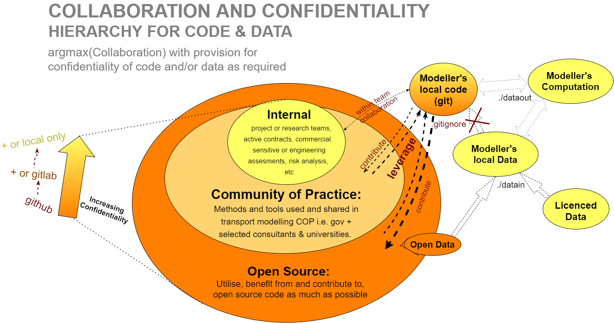

# BayesianTransportModelling

Welcome to the repo that will hopefully facilitate progress and discussion in the application of probabilistic programming to transport and traffic modelling problems.

Transport Modelling is a discipline that uses forecasting and prediction on imperfect models extensively and liberally. Despite this, I still believe in it, because some information is better than none. Nonetheless I feel the industry is due for an introduction to Bayesian methods particularly all the new advancements in methods and useability. I see it having significant benefits for the transport modelling field.

# Structure

Initial phases of this library will heavily leverage methods established in the text book - Statistical Rethinking (Second Edition) and the port of the source code to Numpyro, and some other relevant papers. Essentially the repo will contain toy example implimentations of transport modelling problems solve using bayes stats in jupyter notebooks. The plan then is to progressively build up a library of helper classes/functions for methods or techniques that prove usefull.

# Benefits of bayesian methods

Anticipated benefits of bayesian methods includes: supporting structured human reasoning, python syntax, natural uncertainty quantification, pooling / shrikage for data with varying sample sizes over index variables etc 

# Usage
This package is open source (GPL3).

The content of this package does not contain endorsements or represent the views of any individual or organisation. 

This repository is for exploring ideas. Because we will be exploring possibilities, it needs to be made clear that a user submitting an exploratory method for discussion or through a commit that implies a view, it cannot be interpreted as, for want of a better term, engineering approval. An endorsement or approval is a different process where you mitigate risks after your relevant exploration is complete. Those issues are best discussed with private git lab/hub repositories i.e. "Internal" in the diagram.

Nonetheless, this repository is for the exploration of ideas of how the world works and how we define "good". This is a public process hence open source.

